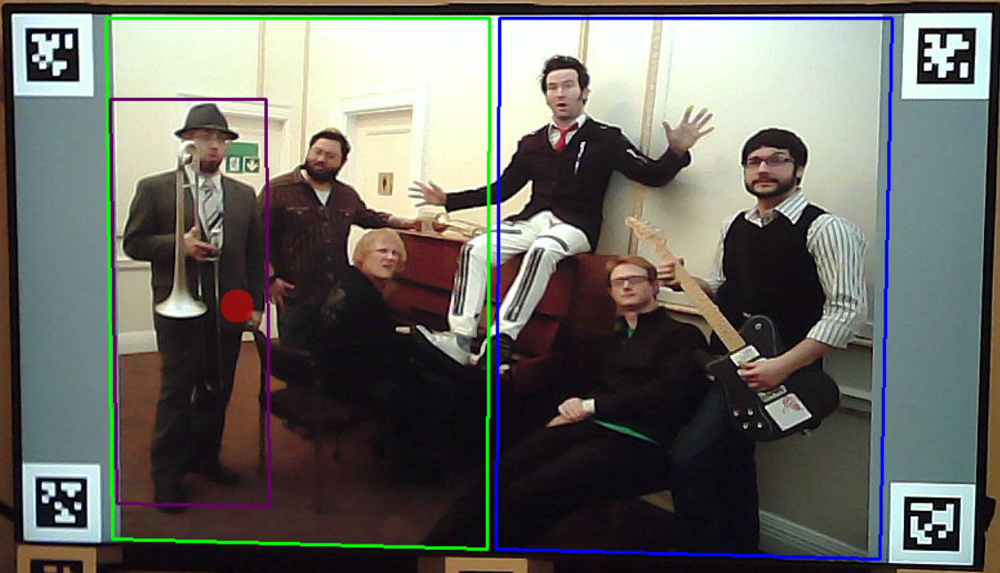
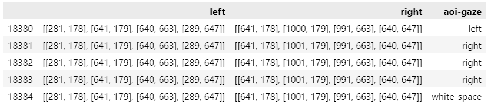

# Offline analysis of gaze data from Pupil Core eye tracker using apriltag detection and customized Areas of Interest (AOI)

## Aim

Use [Python 3](https://www.python.org/), [OpenCV](https://opencv.org/get-started/), and [apriltags](https://pypi.org/project/pupil-apriltags/)and [Pandas](https://pandas.pydata.org/docs/index.html) to create custom AOIs offline, and analyze the distribution of gaze data from a [Pupil Core](https://docs.pupil-labs.com/core/) eye tracker.

## Problem
Pupil-Lab software offers the option to create custom AOIs which are called [Surfaces](https://docs.pupil-labs.com/core/software/pupil-capture/#surface-tracking). Surfaces can be defined in Pupil Capture, or in Pupil Player. However, more flexible, programatic creation of AOIs is not possible.

## Solution
This script allows to customize AOIs programatically, visualize them while replaying the video from the world camera, and analyze data offline in reference to these AOIs.

## Requirements
- Python 3.11
- required packages are included in `requirements.txt`

## Usage 

To run the script, type the following command in a terminal:
```bash
python april_offline.py --set settings-6.yml --run *mode_number*
```
Available modes:
- 0: run analysis, to create CSV file with gaze data + AOI data
- 1: run aoi view, useful to check if AOIs are detected correctly
- 2: run tags view, useful to check if tags are detected correctly, webcam can be used
- 3: run test, similar to mode 1, but with more verbosity

Settings are stored in a YML file, see `settings-4.yml` for an example.
The file includes information about apriltags (family and IDs) which are supposed to be detected, paths and files, the first and final frame of the video to be analyzed, as well as AOIs configuration. Each AOI is defined by:
- name
- four tags with IDs (can be checked in the tags view mode), coordinates of the reference point ([0, 0] means the center of the tag), and proportional shift (horizontal, and vertical) of AOI's vertices (horiz: [0.05, 0.5] means that the left side of the AOI is shifted 5% to the right, and the right side is shifted 50% to the left, so this AOI ends in the middle of the distance between the left and the right tags).
In the example below, the green AOI's parameters are `horiz: [0.06, 0.49]` and `vert: [-0.08, 1.08]`. The blue AOI is defined by parameters `horiz: [0.5, 0.94]` and vert: `[-0.08, 1.08]`. The purple AOI has parameters `horiz: [0.065, 0.24]` and `vert: [0.1, 1]`. Points of reference are the center of the tags.

- color of the frame of the AOI

When using mode 0, the results of the analysis are stored in a Pandas DataFrame and then saved to a CSV file. Each AOI gets its own column which stores its coordinates. The last column contains the name of the AOI in which the gaze point has been detected.

**Note**, that because visual data are processed, the analysis can take several minutes, depending on the video length and the hardware used.

## Known issues
Not found yet
